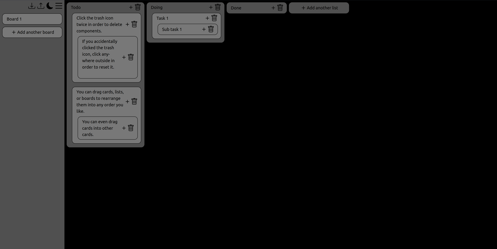

# [Null Todos](https://ryansheehy0.github.io/Null_Todo_App/)
A simple todo app that allows nested todos.

## Todo
- Add dragging
- Side bar stuff
- SQL/db stuff
  - When changing components its important to ensure that their credentials check.
    - Someone could change the UUID in the dom and try and change someone else's card names
- Add accessability things
- Change colors to tailwind colors. There is a good reasons why they are the way they are.
- Use link to specify which user and which board
- Do not put user input in the DOM. The user can input html and break stuff.

## Keyboard Shortcuts

| Keys          | Description           |
|---------------|-----------------------|
| Enter         | New sibling card/list |
| Shift + Enter | New child card        |
| Tab           | Next Focus            |
| Shift + Tab   | Prev Focus            |
| Delete        | Delete card/list      |